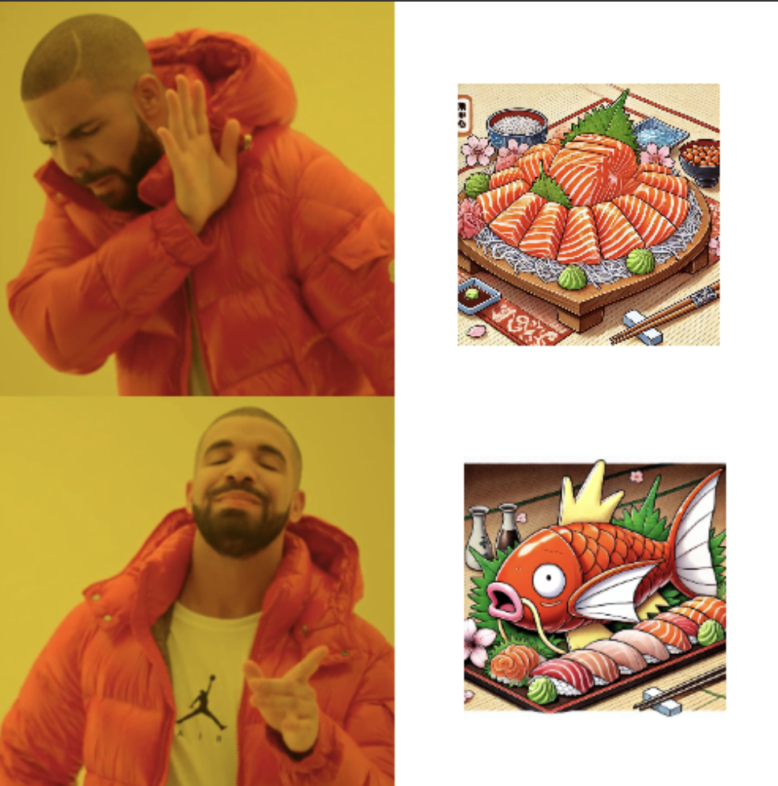
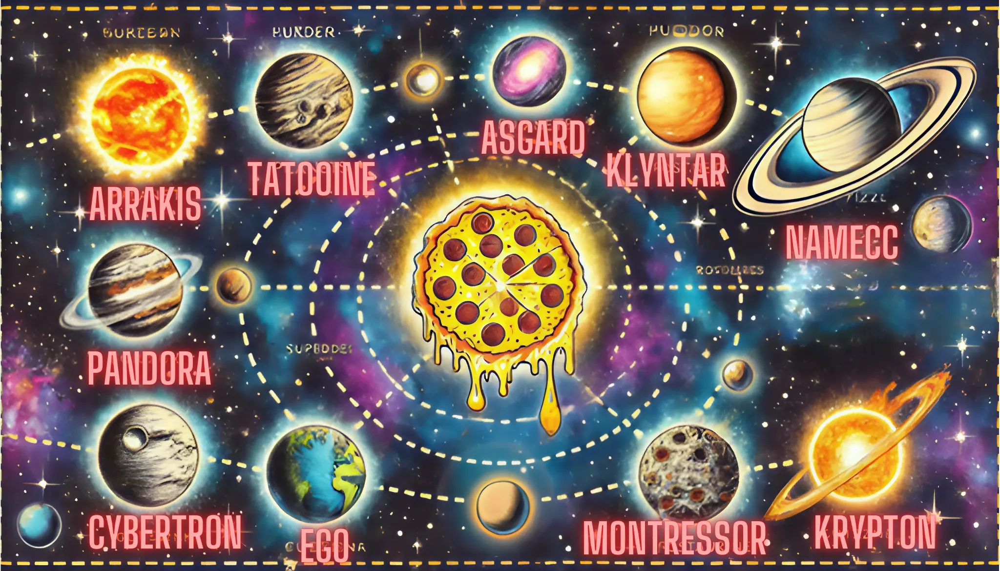
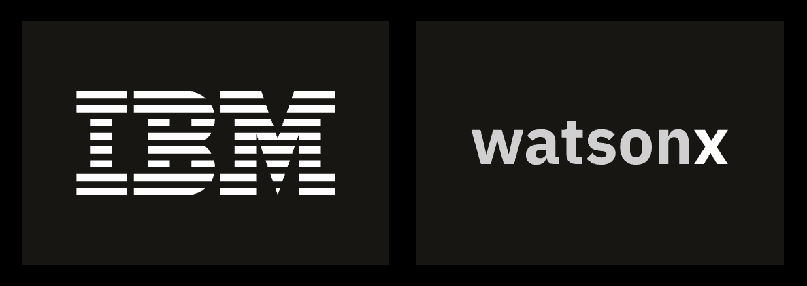

# Hackapizza 2025 🍕

## **Challenge Description**

### Benvenuti e Benvenute,

Prima di tutto, complimenti per essere qui: non è un caso che abbiate superato il processo di selezione e vi siate guadagnati un posto tra i migliori. Infatti, solo il **top 10% dei candidati** ha avuto accesso a questa sfida esclusiva. Questo significa una cosa sola: voi siete il meglio del meglio, **crème de la crème**. 

Ma attenzione: da un grande talento derivano grandi responsabilità.

Infatti, la sfida di oggi non sarà per niente banale. A una prima occhiata potrebbe sembrare complessa, persino scoraggiante. Richiederà tempo, concentrazione e creatività anche solo per essere compresa a fondo.

Ma sappiamo che voi non siete persone che si arrendono davanti alla difficoltà. Al contrario, è proprio davanti a queste sfide che il vero talento emerge. E siamo certi che saprete dimostrare di essere all’altezza.

<div style="text-align: center;">
  
</div>

---

## **Descrizione della Sfida 💫**

Benvenuti nel Ciclo Cosmico 789, dove l'umanità ha superato non solo i confini del proprio sistema solare, ma anche quelli delle dimensioni conosciute. In questo vasto intreccio di realtà e culture, la gastronomia si è evoluta in un'arte che trascende spazio e tempo. 

Ristoranti di ogni tipo arricchiscono il tessuto stesso del multiverso: dai sushi bar di Pandora che servono prelibati sashimi di Magikarp e ravioli al Vaporeon, alle taverne di Tatooine dove l’Erba Pipa viene utilizzata per insaporire piatti prelibati, fino ai moderni locali dove lo Slurm compone salse dai sapori contrastanti - l'universo gastronomico è vasto e pieno di sorprese.

<div style="text-align: center;">
  
</div>

L'espansione galattica ha portato con sé nuove responsabilità. La Federazione Galattica monitora attentamente ogni ingrediente, tecnica di preparazione e certificazione necessaria per garantire che il cibo servito sia sicuro per tutte le specie senzienti. Gli chef devono destreggiarsi tra regolamenti complessi, gestire ingredienti esotici che esistono simultaneamente in più stati quantici e rispettare le restrizioni alimentari di centinaia di specie provenienti da ogni angolo del multiverso.

Nel cuore pulsante di questo arcipelago cosmico di sapori, si erge un elemento di proporzioni titaniche, un'entità che trascende la mera materialità culinaria: la Pizza Cosmica. Si narra che la sua mozzarella sia stata ricavata dalla Via Lattea stessa e che, per cuocerla, sia stato necessario il calore di tre soli. Nessuno conosce le sue origini e culti religiosi hanno fondato la loro fede attorno al suo mistero. 

<div style="text-align: center;">
  
</div>

---

## **Specifiche Tecniche ⚙️**

La vostra missione è sviluppare un assistente AI che aiuti i viaggiatori intergalattici a navigare in questo ricco panorama culinario.

Il sistema dovrà essere in grado di suggerire agli utenti piatti appropriati sulla base delle loro richieste:

- Interpretando domande in linguaggio naturale
- Gestendo query complesse che coinvolgono preferenze e restrizioni alimentari
- Elaborando informazioni provenienti da diverse fonti (menu, blog post, leggi galattiche e manuali di cucina)
- Verificando (qualora richiesto dalla domanda) la conformità dei piatti con le normative vigenti

Inoltre, il vostro sistema dovrà:

- Utilizzare tecniche di Generative AI (RAG, Agenti AI) per processare e comprendere i documenti forniti
- Implementare un modulo software in grado di:
    - Ricevere in input una richiesta utente relativa a possibili piatti che corrispondono a criteri espressi in linguaggio naturale
    - Fornire in output una lista di piatti che rispettano tali criteri sulla base della documentazione fornita

***Che la forza sia con voi.***

---

## **Documentazione 📁**

Avrete accesso a un ricco set di documenti appartenenti a questo ecosistema gastronomico galattico:

- `planets_distance_matrix.csv`
    
    Un csv che contiene la matrice delle distanze in anni luce tra i pianeti su cui si trovano i diversi ristoranti
    
- `Codice Galattico.pdf`
    
    Un documento legislativo contenente:
    
    - Limiti quantitativi applicati all’utilizzo di alcuni ingredienti nella preparazione dei piatti
    - Vincoli relativi alle certificazioni che gli chef hanno bisogno di acquisire per poter utilizzare specifiche tecniche di preparazione dei piatti
- `Manuale di Cucina.md`
    
    Manuale di cucina che include:
    
    - L’elenco e la descrizione delle certificazione che uno chef può acquisire
    - L’elenco degli ordini professionali gastronomici a cui uno chef può aderire
    - L’elenco e la descrizione delle tecniche culinarie di preparazione esistenti
- `Menu (30 ristoranti)`
    
    Documenti in markdown contenenti i menù di 30 ristoranti differenti
    
- `Blog post`
    
    Documenti in markdown che contengono informazioni supplementari su alcuni ristoranti
    
- `dish_mapping.json`
    
    Mappatura dei piatti in id numerici progressivi, necessario per dare l’output finale
    
- `domande.csv`
    
    File contenente la lista di domande con cui verrà valutata la soluzione implementata
    

---

## **Criteri di Valutazione 💯**

La valutazione dei team sarà determinata considerando sia la correttezza delle risposte fornite dal modulo software implementato, sia l'originalità dell'approccio proposto.

La valutazione della correttezza delle risposte avverrà attraverso un set standardizzato di query fornito a tutti i team. Per ogni query, il punteggio di correttezza sarà calcolato utilizzando la Jaccard Similarity, che misurerà la sovrapposizione tra la lista di piatti restituiti dal sistema implementato e la lista di piatti attesi nella soluzione di riferimento.

Esempio di file csv di output da uploadare su Kaggle:

```python
row_id,result
1,"23,122"
2,"12"
3,"11,87"
4,"34,43"
5,"112"
6,"56"
7,"99"
8,"102,103"
9,"11"
10,"11,34"
...

```

Dove:

- `row_id` : indica l’id della query a cui associare la risposta presente nel campo `result`
- `result` : stringa contenente gli id (separati da virgola) dei piatti che rispettano i criteri presenti nella query associata.
    
    Il campo result non può essere mai lasciato vuoto (nemmeno una stringa vuota). C’è sempre almeno un piatto che soddisfa una query.
    
    Per associare il nome di un piatto al corrispettivo id, bisogna usare il file `dish_mapping.json`
    

Esempio di domanda: `"Vorrei assaggiare l'Erba Pipa. In quali piatti la posso trovare?"`

Esempio di risposta: `"1,5"` assumendo che in `dish_mapping.json` è presente un mapping di questo tipo: 

```python
{
	...
	"nome_piatto_che_contiene_erba_pipa_1": 1,
	...
	"nome_piatto_che_contiene_erba_pipa_2": 5,
	...
}

```

---

## **IBM WatsonX 🤖**

Durante la sfida non dovrete spendere soldi di tasca vostra (Let’s go!).

Grazie a **IBM -** partner ufficiale di **Hackapizza 2025 -** ogni team avrà a disposizione `200€` di crediti sulla piattaforma https://www.ibm.com/watsonx.

Di seguito alcuni snippet di codice per installare ed utilizzare il client Python **watsonx**:

```python
pip install ibm-watsonx-ai
```

```python
from ibm_watsonx_ai import Credentials
from ibm_watsonx_ai.foundation_models import ModelInference
```

```python
credentials = Credentials(
    url=ENDPOINT_URL,
    api_key=API_KEY
)
```

```python
model = ModelInference(
    model_id="mistralai/mistral-large", # Che conosciamo bene 😊🏆 
    credentials=credentials,
    project_id=PROJECT_ID,
    params={
        "max_tokens": 200
      }
)

result = model.chat(messages=[{'role': 'user', 'content': "Perchè Datapizza è la community più figa d'Italia?"}])

print(result['choices'][0]['message']['content'])
```

**Forniremo poi l’url, la chiave API e l’id del progetto a ciascun team.**

Altre risorse utili per approfondire:

- Cookbook per **captioning di immagini**: https://github.com/IBM/ibmdotcom-tutorials/blob/main/generative-ai/multimodal-ai.ipynb
- Integrare **watsonx** con LangGraph: https://developer.ibm.com/tutorials/awb-build-tool-calling-agents-with-langgraph-and-flows-engine/

<div style="text-align: center;">
  
</div>

Sulla piattaforma potrete utilizzare diversi modelli di Generative AI, ecco la lista completa dei loro id:

- mistralai/mistral-large
- meta-llama/llama-3-3-70b-instruct
- meta-llama/llama-3-2-90b-vision-instruct
- meta-llama/llama-3-2-3b-instruct
- meta-llama/llama-3-2-11b-vision-instruct
- meta-llama/llama-3-2-1b-instruct
- meta-llama/llama-3-1-70b-instruct
- meta-llama/llama-3-1-8b-instruct
- meta-llama/llama-3-405b-instruct
- meta-llama/llama-3-70b-instruct
- meta-llama/llama-3-8b-instruct
- meta-llama/llama-2-13b-chat
- meta-llama/llama-guard-3-11b-vision
- mistralai/mixtral-8x7b-instruct-v01
- codellama/codellama-34b-instruct-hf
- google/flan-t5-xl
- google/flan-t5-xxl
- google/flan-ul2
- ibm/granite-13b-chat-v2
- ibm/granite-13b-instruct-v2
- ibm/granite-20b-code-instruct
- ibm/granite-20b-multilingual
- ibm/granite-3-2b-instruct
- ibm/granite-3-8b-instruct
- ibm/granite-34b-code-instruct
- ibm/granite-3b-code-instruct
- ibm/granite-8b-code-instruct
- ibm/granite-guardian-3-2b
- ibm/granite-guardian-3-8b

---

## **Regole Generali 🚫**

Durante la sfida è possibile utilizzare qualsiasi modello LLM e qualsiasi framework/libreria già esistenti.

**N.B.:** ricorda che la creatività della soluzione implementata rientra tra i criteri di valutazione!

---

## **Deliverables 💼**

Caricate i file di deliverable tramite questo Google Form: https://docs.google.com/forms/d/e/1FAIpQLSdKAp20WHDdxMqLKSi9oe19-Ndu4_8xKYkyYg36X_bO_si4Rg/viewform?usp=sharing

Ogni team deve caricare i seguenti file:

1. File CSV completo delle risposte che vi ha portato al risultato migliore nella Kaggle Competition 📈
2. Link al repository GitHub contenente la soluzione implementata e link a un’eventuale interfaccia grafica con cui interagire (non è necessario avere un’interfaccia grafica, ma s vi avanza tempo, perchè no 😏)
3. Presentazione: Slide per presentare l'approccio, le sfide e i risultati della soluzione implementata, accompagnate da un pitch coinvolgente 🚀
    
    

---

## **Premi 💰**

I premi verrano erogati tramite **Buoni Amazon**:

🥇 Primo posto: **€3.000**

🥈 Secondo posto: **€2.000**

🥉 Terzo posto: **€1.000**

---

## **Link utili ⛓️**

- Kaggle Competition Hackapizza 🏆: https://www.kaggle.com/t/09f64f2d65214cbcb093eb132c13fcbd
- Server Discord dell’evento: https://discord.gg/7TYa7Jz4
- Google Form per caricare i file di deliverable: https://docs.google.com/forms/d/e/1FAIpQLSdKAp20WHDdxMqLKSi9oe19-Ndu4_8xKYkyYg36X_bO_si4Rg/viewform?usp=sharing